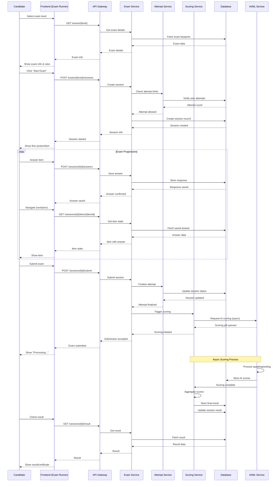
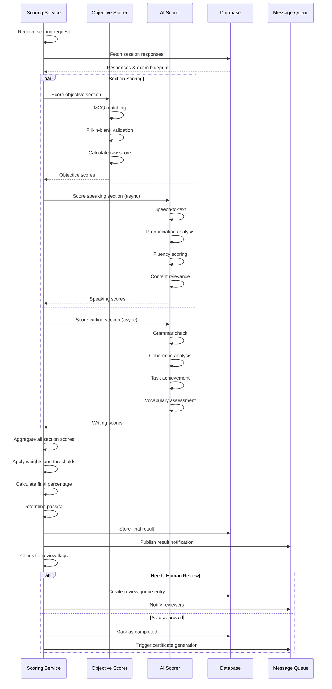
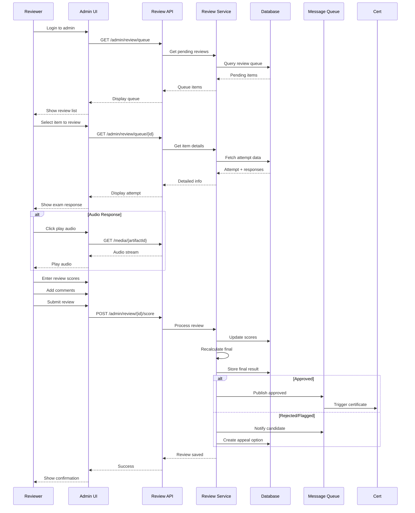

# Technical Architecture: Conversease Real Exam

## 1. System Architecture Overview

### 1.1 High-Level Architecture

```
┌─────────────────────────────────────────────────────────────────┐
│                        Client Layer                              │
├─────────────────────────────────────────────────────────────────┤
│  ┌─────────────┐  ┌──────────────┐  ┌──────────────┐           │
│  │ Exam Runner │  │ Audio Player │  │ Recorder     │           │
│  │ (New)       │  │ (Existing)   │  │ (Existing)   │           │
│  └─────────────┘  └──────────────┘  └──────────────┘           │
└─────────────────────────────────────────────────────────────────┘
                              │
                              ▼
┌─────────────────────────────────────────────────────────────────┐
│                        API Gateway                               │
│  - Auth/AuthZ                                                      │
│  - Rate Limiting                                                 │
│  - Request Validation                                            │
└─────────────────────────────────────────────────────────────────┘
                              │
                              ▼
┌─────────────────────────────────────────────────────────────────┐
│                      Service Layer                               │
├─────────────────────────────────────────────────────────────────┤
│  ┌────────────────┐  ┌────────────────┐  ┌────────────────┐        │
│  │ Exam Service   │  │ Attempt Service│  │ Scoring Service│        │
│  │ (New)          │  │ (Extended)     │  │ (New)          │        │
│  └────────────────┘  └────────────────┘  └────────────────┘        │
│  ┌────────────────┐  ┌────────────────┐  ┌────────────────┐        │
│  │ Content Service│  │ Media Service  │  │ AI/ML Service  │        │
│  │ (Extended)     │  │ (Extended)     │  │ (New)          │        │
│  └────────────────┘  └────────────────┘  └────────────────┘        │
└─────────────────────────────────────────────────────────────────┘
                              │
                              ▼
┌─────────────────────────────────────────────────────────────────┐
│                      Data Layer                                  │
├─────────────────────────────────────────────────────────────────┤
│  ┌──────────────┐  ┌──────────────┐  ┌──────────────┐            │
│  │ PostgreSQL   │  │ Redis        │  │ S3/Cloud     │            │
│  │ (Exam DB)    │  │ (Cache)      │  │ (Media)      │            │
│  └──────────────┘  └──────────────┘  └──────────────┘            │
└─────────────────────────────────────────────────────────────────┘
```

### 1.2 Component Responsibilities

#### 1.2.1 Exam Service (New)
- **Responsibility**: Core exam orchestration
- **Key Functions**:
  - Load exam blueprints and items
  - Manage exam sessions and state
  - Handle exam lifecycle (start, pause, resume, submit)
  - Enforce time limits and section sequencing
  - Validate answers and responses
- **API Endpoints**:
  - `GET /exams/{level}` - Get exam blueprint
  - `POST /exams/{level}/sessions` - Start exam session
  - `GET /exams/sessions/{sessionId}` - Get session state
  - `POST /exams/sessions/{sessionId}/answers` - Submit answer
  - `POST /exams/sessions/{sessionId}/submit` - Final submit
  - `GET /exams/sessions/{sessionId}/result` - Get result

#### 1.2.2 Attempt Service (Extended)
- **Responsibility**: Manage user attempts and history
- **Key Functions**:
  - Track all exam attempts per user
  - Handle attempt lifecycle (official vs practice)
  - Enforce attempt limits and cooldowns
  - Manage draft states
- **Extensions from Current**:
  - Add `mode` field: `practice` | `official`
  - Add `session_data` for real-time exam state
  - Add `item_responses` for granular response tracking
  - Add `media_artifacts` for speaking/writing evidence

#### 1.2.3 Scoring Service (New)
- **Responsibility**: Multi-layered scoring engine
- **Key Functions**:
  - **Objective Scorer**: Auto-score MCQ, fill-in, matching
  - **AI Scorer**: Score speaking/writing via ML models
  - **Final Aggregator**: Combine scores with weights and rules
- **Scoring Pipeline**:
  ```
  Raw Response → Validation → Preprocessing → 
  Section Scoring (Objective/AI/Hybrid) → 
  Score Aggregation → Final Result → Review Queue (if needed)
  ```

#### 1.2.4 Content Service (Extended)
- **Responsibility**: Exam content management
- **Key Functions**:
  - Load and validate exam blueprints
  - Manage item banks per level
  - Handle content versioning
  - Support A/B testing for items
- **New Components**:
  - `ExamBlueprintLoader`
  - `ItemBankManager`
  - `ContentVersionController`

#### 1.2.5 Media Service (Extended)
- **Responsibility**: Audio/video media handling
- **Key Functions**:
  - Stream audio for listening sections
  - Store and retrieve speaking recordings
  - Transcode and optimize media
  - Generate transcripts via STT
- **New Components**:
  - `ExamAudioStreamer`
  - `SpeakingEvidenceManager`
  - `TranscriptGenerator`

#### 1.2.6 AI/ML Service (New)
- **Responsibility**: AI-powered assessment
- **Key Functions**:
  - **Speech Assessment**: Pronunciation, fluency, content accuracy
  - **Writing Assessment**: Grammar, coherence, task achievement, vocabulary
  - **Confidence Scoring**: Reliability metric for auto-grading
- **Models Needed**:
  - ASR (Automatic Speech Recognition)
  - Speech scoring model
  - Essay scoring model (fine-tuned LLM or specialized model)
  - Sentence-level grammar checker

---

## 2. Data Model

### 2.1 Core Entities

#### 2.1.1 Exam
```typescript
interface Exam {
  id: string;
  levelCode: 'A1' | 'A2' | 'B1' | 'B2' | 'C1';
  version: string;
  status: 'draft' | 'published' | 'archived';
  sections: ExamSection[];
  config: ExamConfig;
  createdAt: Date;
  updatedAt: Date;
}

interface ExamConfig {
  totalDurationMinutes: number;
  allowPause: boolean;
  maxAttempts: number;
  cooldownDays: number;
  passingThreshold: number;
  sectionSequence: 'strict' | 'flexible';
}
```

#### 2.1.2 ExamSection
```typescript
interface ExamSection {
  id: string;
  examId: string;
  type: 'listening' | 'reading' | 'grammar_vocabulary' | 'speaking' | 'writing';
  title: string;
  description: string;
  items: ExamItem[];
  config: SectionConfig;
  weight: number; // Percentage of total score
  minimumScore: number; // Minimum to pass this section
}

interface SectionConfig {
  durationMinutes: number;
  allowNavigation: boolean;
  showProgress: boolean;
  audioPlayCount: number; // For listening
}
```

#### 2.1.3 ExamItem
```typescript
interface ExamItem {
  id: string;
  sectionId: string;
  type: 'mcq' | 'fill_in_blank' | 'matching' | 'short_answer' | 'essay' | 'audio_response';
  stimulus: Stimulus;
  prompt: string;
  choices?: Choice[]; // For MCQ
  correctAnswer?: string | string[]; // For auto-scoring
  rubric?: Rubric; // For AI/human scoring
  points: number;
  difficulty: 'easy' | 'medium' | 'hard';
  skills: string[]; // Related skills being tested
}

interface Stimulus {
  type: 'text' | 'audio' | 'image' | 'combined';
  content: string; // Text content or reference to audio/image asset
  audioUrl?: string;
  transcript?: string; // For accessibility
}

interface Choice {
  id: string;
  text: string;
  isCorrect?: boolean; // Internal, not exposed to client
}

interface Rubric {
  criteria: Criterion[];
  maxScore: number;
  scoringGuide: string;
}

interface Criterion {
  name: string;
  description: string;
  weight: number;
  levels: ScoringLevel[];
}

interface ScoringLevel {
  score: number;
  description: string;
  example?: string;
}
```

#### 2.1.4 ExamSession
```typescript
interface ExamSession {
  id: string;
  userId: string;
  examId: string;
  mode: 'practice' | 'official';
  status: 'created' | 'in_progress' | 'paused' | 'submitted' | 'processing' | 'completed' | 'expired';
  currentSectionId?: string;
  currentItemId?: string;
  sectionProgress: SectionProgress[];
  responses: ItemResponse[];
  mediaArtifacts: MediaArtifact[];
  timing: SessionTiming;
  result?: ExamResult;
  metadata: SessionMetadata;
  createdAt: Date;
  startedAt?: Date;
  submittedAt?: Date;
  completedAt?: Date;
}

interface SectionProgress {
  sectionId: string;
  status: 'locked' | 'available' | 'in_progress' | 'completed';
  itemsCompleted: number;
  itemsTotal: number;
  timeSpentSeconds: number;
}

interface ItemResponse {
  itemId: string;
  sectionId: string;
  responseType: 'text' | 'audio' | 'file';
  responseData: string; // Text content or reference to media
  mediaArtifactId?: string;
  confidence?: number; // For AI-scored responses
  metadata: ResponseMetadata;
  timestamp: Date;
  timeSpentSeconds: number;
}

interface MediaArtifact {
  id: string;
  type: 'audio' | 'image' | 'document';
  url: string;
  thumbnailUrl?: string;
  duration?: number; // For audio/video
  size: number;
  mimeType: string;
  transcript?: string; // Auto-generated transcript
  metadata: ArtifactMetadata;
  createdAt: Date;
}

interface SessionTiming {
  totalDurationMinutes: number;
  timeRemainingSeconds: number;
  timeSpentSeconds: number;
  sectionTimes: Record<string, number>;
  lastActivityAt: Date;
  autoSubmitAt?: Date;
}

interface SessionMetadata {
  userAgent: string;
  ipAddress: string;
  deviceType: 'desktop' | 'tablet' | 'mobile';
  browser: string;
  screenResolution: string;
  proctoringSnapshot?: string; // For future proctoring features
}
```

#### 2.1.5 ExamResult
```typescript
interface ExamResult {
  id: string;
  sessionId: string;
  userId: string;
  examId: string;
  status: 'processing' | 'pending_review' | 'completed' | 'appealed';
  overallScore: number;
  maxPossibleScore: number;
  percentage: number;
  passed: boolean;
  grade?: string; // e.g., 'A', 'B', 'C', 'D', 'F'
  level: 'A1' | 'A2' | 'B1' | 'B2' | 'C1';
  sectionResults: SectionResult[];
  skillScores: SkillScore[];
  processing: ProcessingInfo;
  review?: ReviewInfo;
  certificate?: CertificateInfo;
  metadata: ResultMetadata;
  createdAt: Date;
  completedAt?: Date;
}

interface SectionResult {
  sectionId: string;
  sectionType: string;
  rawScore: number;
  maxScore: number;
  percentage: number;
  weight: number;
  weightedContribution: number;
  passed: boolean;
  minimumRequired: number;
  itemResults: ItemResult[];
  timeSpentSeconds: number;
}

interface ItemResult {
  itemId: string;
  itemType: string;
  response: string;
  correctAnswer?: string;
  isCorrect?: boolean;
  score: number;
  maxScore: number;
  feedback?: string;
  confidence?: number;
  processingMethod: 'auto' | 'ai' | 'human' | 'hybrid';
  reviewStatus?: 'pending' | 'approved' | 'rejected';
  timeSpentSeconds: number;
}

interface SkillScore {
  skill: string; // e.g., 'listening', 'speaking', 'reading', 'writing'
  score: number;
  maxScore: number;
  percentage: number;
  level: string; // e.g., 'A1', 'A2', etc.
  strengths: string[];
  weaknesses: string[];
}

interface ProcessingInfo {
  startedAt: Date;
  completedAt?: Date;
  stages: ProcessingStage[];
  currentStage: string;
  estimatedCompletion?: Date;
  aiModelsUsed: string[];
  processingCost?: number; // For tracking AI costs
}

interface ProcessingStage {
  name: string;
  status: 'pending' | 'processing' | 'completed' | 'failed';
  startedAt?: Date;
  completedAt?: Date;
  progress: number; // 0-100
  details?: string;
}

interface ReviewInfo {
  reviewerId?: string;
  reviewerName?: string;
  startedAt?: Date;
  completedAt?: Date;
  sectionsReviewed: string[];
  originalScores: Record<string, number>;
  adjustedScores: Record<string, number>;
  comments: string;
  approved: boolean;
}

interface CertificateInfo {
  certificateId: string;
  issuedAt: Date;
  expiresAt?: Date;
  verificationUrl: string;
  pdfUrl: string;
  badgeImageUrl?: string;
  blockchainHash?: string; // For future verification
}

interface ResultMetadata {
  examVersion: string;
  scoringVersion: string;
  aiModelVersions: Record<string, string>;
  processingServer?: string;
  ipAddress?: string;
  userAgent?: string;
}
```

---

## 2. API Design

### 2.1 Exam Management APIs

```yaml
# Exam CRUD (Admin)
GET    /api/v1/admin/exams                    # List all exams
POST   /api/v1/admin/exams                    # Create new exam
GET    /api/v1/admin/exams/{examId}            # Get exam details
PUT    /api/v1/admin/exams/{examId}           # Update exam
DELETE /api/v1/admin/exams/{examId}           # Delete exam (soft)

# Exam Content Management
GET    /api/v1/admin/exams/{examId}/sections     # List sections
POST   /api/v1/admin/exams/{examId}/sections     # Add section
PUT    /api/v1/admin/exams/{examId}/sections/{sectionId}  # Update section
DELETE /api/v1/admin/exams/{examId}/sections/{sectionId} # Delete section

# Item Management
GET    /api/v1/admin/exams/{examId}/items      # List all items
POST   /api/v1/admin/exams/{examId}/items      # Create item
PUT    /api/v1/admin/exams/{examId}/items/{itemId}  # Update item
DELETE /api/v1/admin/exams/{examId}/items/{itemId}  # Delete item

# Exam Publishing
POST   /api/v1/admin/exams/{examId}/publish    # Publish exam
POST   /api/v1/admin/exams/{examId}/unpublish  # Unpublish exam
POST   /api/v1/admin/exams/{examId}/archive    # Archive exam
```

### 2.2 Candidate Exam APIs

```yaml
# Exam Discovery
GET    /api/v1/exams                           # List available exams
GET    /api/v1/exams/{level}                    # Get exam details
GET    /api/v1/exams/{level}/preview            # Preview exam structure

# Exam Session Management
POST   /api/v1/exams/{level}/sessions           # Start new exam session
GET    /api/v1/exams/sessions/{sessionId}       # Get session status
POST   /api/v1/exams/sessions/{sessionId}/pause # Pause session
POST   /api/v1/exams/sessions/{sessionId}/resume # Resume session
POST   /api/v1/exams/sessions/{sessionId}/extend # Request time extension

# Answer Submission
POST   /api/v1/exams/sessions/{sessionId}/answers           # Submit answer
PUT    /api/v1/exams/sessions/{sessionId}/answers/{answerId}  # Update answer
POST   /api/v1/exams/sessions/{sessionId}/media               # Upload media (audio/file)
POST   /api/v1/exams/sessions/{sessionId}/submit              # Final submission

# Results
GET    /api/v1/exams/sessions/{sessionId}/result              # Get result (if available)
GET    /api/v1/exams/results                                  # List all results for user
GET    /api/v1/exams/results/{resultId}                       # Get specific result
POST   /api/v1/exams/results/{resultId}/appeal                # Appeal result
```

### 2.3 Admin Review APIs

```yaml
# Review Queue
GET    /api/v1/admin/review/queue            # Get items needing review
GET    /api/v1/admin/review/queue/{itemId}     # Get specific item details

# Review Actions
POST   /api/v1/admin/review/{attemptId}/score          # Submit review score
PUT    /api/v1/admin/review/{attemptId}/score          # Update review score
POST   /api/v1/admin/review/{attemptId}/approve        # Approve result
POST   /api/v1/admin/review/{attemptId}/reject         # Reject/flag result
POST   /api/v1/admin/review/{attemptId}/comment        # Add review comment

# Bulk Operations
POST   /api/v1/admin/review/batch/approve    # Batch approve
POST   /api/v1/admin/review/batch/reject     # Batch reject
POST   /api/v1/admin/review/batch/assign      # Batch assign to reviewers

# Appeals
GET    /api/v1/admin/appeals                  # List appeals
GET    /api/v1/admin/appeals/{appealId}       # Get appeal details
POST   /api/v1/admin/appeals/{appealId}/resolve  # Resolve appeal
```

### 2.4 Scoring & AI APIs

```yaml
# Scoring Jobs
POST   /api/v1/admin/scoring/jobs            # Trigger scoring job
GET    /api/v1/admin/scoring/jobs/{jobId}     # Get job status
GET    /api/v1/admin/scoring/jobs/{jobId}/result  # Get job result

# AI Model Management
GET    /api/v1/admin/ai/models               # List available models
GET    /api/v1/admin/ai/models/{modelId}     # Get model details
POST   /api/v1/admin/ai/models/{modelId}/deploy    # Deploy model
POST   /api/v1/admin/ai/models/{modelId}/rollback   # Rollback model

# Scoring Calibration
POST   /api/v1/admin/scoring/calibrate       # Run calibration
GET    /api/v1/admin/scoring/calibration/{id}      # Get calibration results
POST   /api/v1/admin/scoring/thresholds            # Update scoring thresholds
```

---

## 3. Database Schema

### 3.1 Core Tables

```sql
-- Exams table
CREATE TABLE exams (
    id UUID PRIMARY KEY DEFAULT gen_random_uuid(),
    level_code VARCHAR(10) NOT NULL CHECK (level_code IN ('A1', 'A2', 'B1', 'B2', 'C1')),
    version VARCHAR(20) NOT NULL,
    title VARCHAR(255) NOT NULL,
    description TEXT,
    status VARCHAR(20) NOT NULL CHECK (status IN ('draft', 'published', 'archived')),
    config JSONB NOT NULL DEFAULT '{}',
    total_duration_minutes INTEGER NOT NULL,
    passing_threshold INTEGER NOT NULL,
    max_attempts INTEGER DEFAULT 3,
    cooldown_days INTEGER DEFAULT 30,
    created_by UUID REFERENCES users(id),
    published_at TIMESTAMP,
    created_at TIMESTAMP DEFAULT NOW(),
    updated_at TIMESTAMP DEFAULT NOW(),
    
    UNIQUE(level_code, version)
);

-- Exam sections
CREATE TABLE exam_sections (
    id UUID PRIMARY KEY DEFAULT gen_random_uuid(),
    exam_id UUID NOT NULL REFERENCES exams(id) ON DELETE CASCADE,
    type VARCHAR(30) NOT NULL CHECK (type IN ('listening', 'reading', 'grammar_vocabulary', 'speaking', 'writing')),
    title VARCHAR(255) NOT NULL,
    description TEXT,
    instructions TEXT,
    weight INTEGER NOT NULL CHECK (weight >= 0 AND weight <= 100),
    minimum_score INTEGER NOT NULL DEFAULT 0,
    duration_minutes INTEGER NOT NULL,
    sequence_order INTEGER NOT NULL,
    allow_navigation BOOLEAN DEFAULT true,
    show_progress BOOLEAN DEFAULT true,
    config JSONB DEFAULT '{}',
    created_at TIMESTAMP DEFAULT NOW(),
    updated_at TIMESTAMP DEFAULT NOW(),
    
    UNIQUE(exam_id, sequence_order)
);

-- Exam items (questions)
CREATE TABLE exam_items (
    id UUID PRIMARY KEY DEFAULT gen_random_uuid(),
    section_id UUID NOT NULL REFERENCES exam_sections(id) ON DELETE CASCADE,
    type VARCHAR(30) NOT NULL CHECK (type IN ('mcq', 'fill_in_blank', 'matching', 'short_answer', 'essay', 'audio_response')),
    stimulus JSONB NOT NULL, -- { type, content, audioUrl, imageUrl, etc. }
    prompt TEXT NOT NULL,
    choices JSONB, -- For MCQ: [{ id, text, isCorrect }]
    correct_answer JSONB, -- Answer key for auto-scoring
    rubric JSONB, -- Scoring rubric for AI/human grading
    points INTEGER NOT NULL DEFAULT 1,
    difficulty VARCHAR(10) CHECK (difficulty IN ('easy', 'medium', 'hard')),
    skills TEXT[], -- Array of skill tags
    sequence_order INTEGER NOT NULL,
    config JSONB DEFAULT '{}',
    version INTEGER DEFAULT 1,
    created_by UUID REFERENCES users(id),
    reviewed_by UUID REFERENCES users(id),
    reviewed_at TIMESTAMP,
    created_at TIMESTAMP DEFAULT NOW(),
    updated_at TIMESTAMP DEFAULT NOW(),
    
    UNIQUE(section_id, sequence_order)
);

-- Exam sessions
CREATE TABLE exam_sessions (
    id UUID PRIMARY KEY DEFAULT gen_random_uuid(),
    user_id UUID NOT NULL REFERENCES users(id),
    exam_id UUID NOT NULL REFERENCES exams(id),
    mode VARCHAR(20) NOT NULL CHECK (mode IN ('practice', 'official')),
    status VARCHAR(20) NOT NULL CHECK (status IN ('created', 'in_progress', 'paused', 'submitted', 'processing', 'completed', 'expired', 'abandoned')),
    current_section_id UUID REFERENCES exam_sections(id),
    current_item_id UUID REFERENCES exam_items(id),
    section_progress JSONB NOT NULL DEFAULT '[]',
    timing JSONB NOT NULL DEFAULT '{}',
    metadata JSONB DEFAULT '{}',
    started_at TIMESTAMP,
    paused_at TIMESTAMP,
    resumed_at TIMESTAMP,
    submitted_at TIMESTAMP,
    completed_at TIMESTAMP,
    expires_at TIMESTAMP NOT NULL,
    created_at TIMESTAMP DEFAULT NOW(),
    updated_at TIMESTAMP DEFAULT NOW()
);

-- Item responses
CREATE TABLE item_responses (
    id UUID PRIMARY KEY DEFAULT gen_random_uuid(),
    session_id UUID NOT NULL REFERENCES exam_sessions(id) ON DELETE CASCADE,
    item_id UUID NOT NULL REFERENCES exam_items(id),
    section_id UUID NOT NULL REFERENCES exam_sections(id),
    response_type VARCHAR(20) NOT NULL CHECK (response_type IN ('text', 'audio', 'file', 'composite')),
    response_data TEXT, // Text content or JSON with references
    media_artifact_ids UUID[],
    confidence FLOAT,
    metadata JSONB DEFAULT '{}',
    timestamp TIMESTAMP DEFAULT NOW(),
    time_spent_seconds INTEGER,
    version INTEGER DEFAULT 1, // For tracking edits
    created_at TIMESTAMP DEFAULT NOW(),
    updated_at TIMESTAMP DEFAULT NOW(),
    
    UNIQUE(session_id, item_id)
);

-- Media artifacts
CREATE TABLE media_artifacts (
    id UUID PRIMARY KEY DEFAULT gen_random_uuid(),
    response_id UUID REFERENCES item_responses(id) ON DELETE CASCADE,
    user_id UUID NOT NULL REFERENCES users(id),
    type VARCHAR(20) NOT NULL CHECK (type IN ('audio', 'image', 'document', 'video')),
    url TEXT NOT NULL,
    thumbnail_url TEXT,
    duration_seconds FLOAT, // For audio/video
    size_bytes INTEGER,
    mime_type VARCHAR(100),
    transcript TEXT, // Auto-generated transcript for audio
    confidence FLOAT, // Transcript confidence
    metadata JSONB DEFAULT '{}',
    created_at TIMESTAMP DEFAULT NOW(),
    expires_at TIMESTAMP // For temporary storage
);

-- Exam results
CREATE TABLE exam_results (
    id UUID PRIMARY KEY DEFAULT gen_random_uuid(),
    session_id UUID NOT NULL REFERENCES exam_sessions(id),
    user_id UUID NOT NULL REFERENCES users(id),
    exam_id UUID NOT NULL REFERENCES exams(id),
    status VARCHAR(20) NOT NULL CHECK (status IN ('processing', 'pending_review', 'completed', 'appealed', 'voided')),
    overall_score INTEGER,
    max_possible_score INTEGER,
    percentage FLOAT,
    passed BOOLEAN,
    grade VARCHAR(5),
    level VARCHAR(10),
    section_results JSONB NOT NULL,
    skill_scores JSONB NOT NULL,
    processing_info JSONB,
    review_info JSONB,
    certificate_id UUID,
    metadata JSONB,
    created_at TIMESTAMP DEFAULT NOW(),
    updated_at TIMESTAMP DEFAULT NOW(),
    
    UNIQUE(session_id)
);

-- Review queue
CREATE TABLE review_queue (
    id UUID PRIMARY KEY DEFAULT gen_random_uuid(),
    result_id UUID NOT NULL REFERENCES exam_results(id),
    item_response_id UUID REFERENCES item_responses(id),
    type VARCHAR(20) NOT NULL CHECK (type IN ('full_exam', 'section', 'item')),
    status VARCHAR(20) NOT NULL CHECK (status IN ('pending', 'in_review', 'completed', 'escalated')),
    priority INTEGER DEFAULT 5, // 1-10, lower is higher priority
    assigned_to UUID REFERENCES users(id),
    original_score INTEGER,
    reviewed_score INTEGER,
    confidence_score FLOAT,
    flags JSONB, // Reasons for human review
    notes TEXT,
    started_at TIMESTAMP,
    completed_at TIMESTAMP,
    created_at TIMESTAMP DEFAULT NOW(),
    updated_at TIMESTAMP DEFAULT NOW()
);

-- Certificates
CREATE TABLE certificates (
    id UUID PRIMARY KEY DEFAULT gen_random_uuid(),
    result_id UUID NOT NULL REFERENCES exam_results(id),
    user_id UUID NOT NULL REFERENCES users(id),
    exam_id UUID NOT NULL REFERENCES exams(id),
    certificate_number VARCHAR(50) UNIQUE NOT NULL,
    level VARCHAR(10) NOT NULL,
    score INTEGER NOT NULL,
    percentage FLOAT NOT NULL,
    grade VARCHAR(5) NOT NULL,
    issued_at TIMESTAMP NOT NULL DEFAULT NOW(),
    expires_at TIMESTAMP,
    verification_url TEXT NOT NULL,
    pdf_url TEXT NOT NULL,
    badge_image_url TEXT,
    blockchain_hash TEXT,
    metadata JSONB,
    revoked BOOLEAN DEFAULT FALSE,
    revoked_at TIMESTAMP,
    revoked_reason TEXT,
    created_at TIMESTAMP DEFAULT NOW(),
    updated_at TIMESTAMP DEFAULT NOW()
);

-- Indexes for performance
CREATE INDEX idx_exams_level_status ON exams(level_code, status);
CREATE INDEX idx_exam_sections_exam ON exam_sections(exam_id);
CREATE INDEX idx_exam_items_section ON exam_items(section_id);
CREATE INDEX idx_exam_sessions_user ON exam_sessions(user_id, status);
CREATE INDEX idx_exam_sessions_exam ON exam_sessions(exam_id, status);
CREATE INDEX idx_item_responses_session ON item_responses(session_id);
CREATE INDEX idx_exam_results_user ON exam_results(user_id, status);
CREATE INDEX idx_exam_results_session ON exam_results(session_id);
CREATE INDEX idx_review_queue_assigned ON review_queue(assigned_to, status);
CREATE INDEX idx_review_queue_result ON review_queue(result_id);
```

---

## 3. Key Workflows

### 3.1 Candidate Exam Workflow



### 3.2 Scoring Workflow



### 3.3 Admin Review Workflow



---

## 4. Integration Architecture

### 4.1 AI/ML Integration

```yaml
AI Service Integration:
  Speech Recognition:
    Provider: Whisper / Google Cloud Speech / Azure Speech
    Endpoints:
      - POST /ai/stt/transcribe
      - POST /ai/stt/batch
    Models:
      - whisper-large-v3
      - gcloud-speech-premium
    
  Speech Assessment:
    Provider: Custom / ELSA Speak API / Speechace
    Endpoints:
      - POST /ai/speech/score
      - POST /ai/speech/assess-pronunciation
      - POST /ai/speech/assess-fluency
    Metrics:
      - Pronunciation accuracy
      - Intonation
      - Rhythm and stress
      - Speech rate (WPM)
      - Pause appropriateness
      
  Writing Assessment:
    Provider: GPT-4 / Claude / Custom fine-tuned model
    Endpoints:
      - POST /ai/writing/score
      - POST /ai/writing/assess-grammar
      - POST /ai/writing/assess-coherence
      - POST /ai/writing/assess-task-achievement
    Rubric Dimensions:
      - Task achievement/response
      - Coherence and cohesion
      - Lexical resource
      - Grammatical range and accuracy
      
  Confidence Scoring:
    Endpoint: POST /ai/confidence/calculate
    Input: Raw scores + model metadata
    Output: Confidence score (0-1) + uncertainty metrics
```

### 4.2 Third-Party Integrations

```yaml
Proctoring (Future):
  Provider: Proctorio / ProctorU / Honorlock
  Integration: LTI 1.3 / Custom API
  Features:
    - ID verification
    - Browser lockdown
    - Video recording
    - AI flagging
    
Certificate Issuance:
  Provider: Accredible / Credly / Custom
  Integration: REST API
  Features:
    - Digital credential creation
    - Blockchain verification (optional)
    - Social sharing
    - LinkedIn integration
    
Analytics:
  Provider: Mixpanel / Amplitude / Segment
  Integration: SDK + REST
  Events:
    - Exam started/completed
    - Section transitions
    - Answer submissions
    - Time spent
    - Abandonment
```

---

## 5. Security Architecture

### 5.1 Authentication & Authorization

```yaml
Authentication:
  Method: JWT with refresh tokens
  Providers:
    - Email/password
    - Google OAuth
    - SSO (SAML 2.0 for enterprise)
  MFA: TOTP (optional for candidates, required for admins)
  
Authorization:
  Model: RBAC with resource-level permissions
  Roles:
    candidate:
      - Take exams
      - View own results
      - Request appeals
    proctor:
      - Monitor live exams
      - Review flagged sessions
    reviewer:
      - Review speaking/writing
      - Override scores
    content_admin:
      - Create/edit exams
      - Manage item banks
      - Publish exams
    system_admin:
      - All permissions
      - User management
      - System configuration
```

### 5.2 Data Security

```yaml
Encryption:
  At Rest:
    - Database: AES-256
    - File storage: Server-side encryption (S3 SSE-KMS)
    - Backups: Encrypted with unique keys
  In Transit:
    - TLS 1.3 for all communications
    - Certificate pinning for mobile apps (future)
    
Data Classification:
  Sensitive:
    - Audio recordings (speaking responses)
    - Personal identification
    - Exam responses (before publication)
    - Review notes
  Standard:
    - Exam blueprints (published)
    - Results (after publication)
    - User profiles
    
Access Controls:
  - Principle of least privilege
  - Audit logging for all data access
  - Data masking for non-production environments
  - Row-level security for multi-tenant data
```

### 5.3 Exam Security

```yaml
Anti-Cheating Measures:
  Technical:
    - Browser lockdown (disallow new tabs, copy/paste)
    - Full-screen enforcement
    - IP-based session binding
    - Device fingerprinting
    - Multiple face detection (future)
  
  Operational:
    - Question randomization (item banks)
    - Answer option shuffling
    - Time limits per section
    - No backward navigation (optional)
    - Proctor monitoring (future)
    
Fraud Detection:
  - Unusual answer patterns (too fast, all same option)
  - Multiple accounts from same device/IP
  - Collusion detection (similar answers across users)
  - Unauthorized access attempts
  
Response to Violations:
  - Automatic flagging
  - Session termination
  - Result invalidation
  - Account suspension
  - Review by admin team
```

---

## 6. Scalability & Performance

### 6.1 Scaling Strategy

```yaml
Horizontal Scaling:
  Web Tier:
    - Auto-scaling groups based on CPU/memory
    - Min: 2 instances, Max: 20 instances
    - Load balancer with health checks
    
  API Tier:
    - Container orchestration (Kubernetes)
    - Horizontal pod autoscaling
    - Circuit breakers for downstream services
    
  Worker Tier:
    - Separate queues per job type
    - Scalable worker pools
    - Priority queuing
    
Database Scaling:
  Read Replicas:
    - 3 read replicas for reporting queries
    - Automatic failover
    
  Sharding (Future):
    - Shard by user_id for user-related tables
    - Shard by exam_id for exam-related tables
    
  Partitioning:
    - Time-based partitioning for large tables
    - Separate hot/warm/cold data
```

### 6.2 Performance Targets

```yaml
Response Times:
  API Endpoints:
    - GET /exams/*: < 100ms (cached)
    - POST /sessions: < 200ms
    - POST /answers: < 150ms
    - GET /results: < 200ms
    
  Page Load:
    - Exam start page: < 2s
    - Exam runner: < 1.5s initial load
    - Section transitions: < 500ms
    
  Media:
    - Audio load: < 3s
    - Audio play latency: < 100ms
    - Recording upload: < 5s (compressed)
    
Throughput:
  Concurrent Users:
    - Target: 1000 simultaneous exams
    - Peak: 5000 simultaneous exams
    
  API Requests:
    - Sustained: 10,000 req/min
    - Peak: 50,000 req/min
    
  Scoring Jobs:
    - Process: 1000 exams/day
    - Peak: 5000 exams/day
```

### 6.3 Caching Strategy

```yaml
Multi-Layer Caching:
  CDN (CloudFront/Cloudflare):
    - Static assets (JS, CSS, images)
    - Audio files for listening
    - Exam blueprints (read-heavy)
    - TTL: 1 hour for assets, 24 hours for blueprints
    
  Redis Cache:
    - Active exam sessions
    - User progress
    - Exam metadata
    - Scoring results (temporary)
    - TTL: Session duration + 1 hour
    
  Application Cache:
    - In-memory exam blueprints
    - Scoring rules
    - User permissions
    - TTL: 5 minutes
    
Cache Invalidation:
  - Exam published: Invalidate CDN + Redis
  - User completes exam: Clear user progress cache
  - Scoring complete: Update result cache
  - Emergency: Global cache flush capability
```

---

## 7. Monitoring & Observability

### 7.1 Logging

```yaml
Log Levels:
  ERROR: System errors, exceptions, security incidents
  WARN: Performance degradation, resource constraints
  INFO: User actions, state transitions, business events
  DEBUG: Detailed flow, variable values (development only)
  
Log Categories:
  - exam: Exam lifecycle events
  - session: Session management
  - scoring: Scoring pipeline
  - security: Auth, access, incidents
  - performance: Timing, resource usage
  - business: High-level business events
  
Structured Logging:
  ```json
  {
    "timestamp": "2024-01-15T10:30:00Z",
    "level": "INFO",
    "category": "exam",
    "event": "exam_submitted",
    "trace_id": "abc123",
    "user_id": "user456",
    "exam_id": "exam789",
    "session_id": "session012",
    "duration_seconds": 3600,
    "sections_completed": 5,
    "metadata": {
      "ip_address": "192.168.1.1",
      "user_agent": "Mozilla/5.0..."
    }
  }
  ```
```

### 7.2 Metrics

```yaml
Business Metrics:
  - exam_started_total: Counter of exams started
  - exam_completed_total: Counter of exams completed
  - exam_abandoned_total: Counter of exams abandoned
  - exam_duration_seconds: Histogram of exam durations
  - score_distribution: Histogram of final scores
  - pass_rate: Gauge of pass rate per exam/level
  
Technical Metrics:
  - api_request_duration_seconds: Histogram of API response times
  - api_request_total: Counter of API requests by endpoint
  - api_error_rate: Gauge of error rates
  - database_query_duration_seconds: Histogram of query times
  - database_connection_pool: Gauge of connection pool usage
  - cache_hit_rate: Gauge of cache hit rates
  - scoring_job_duration_seconds: Histogram of scoring job times
  - scoring_queue_depth: Gauge of scoring queue size
  
Infrastructure Metrics:
  - cpu_usage_percent: Gauge of CPU usage
  - memory_usage_bytes: Gauge of memory usage
  - disk_usage_bytes: Gauge of disk usage
  - network_io_bytes: Counter of network I/O
  - container_restart_count: Counter of container restarts
```

### 7.3 Alerting

```yaml
Critical Alerts (P1 - Immediate Response):
  - Database connection failures
  - Service down (all instances)
  - Security breach detected
  - Data corruption detected
  - Payment processing failures
  - SLA violations (exam submission failure)
  
High Priority (P2 - Response within 1 hour):
  - Error rate > 5% for 5 minutes
  - Response time > 2s for 5 minutes
  - Queue depth > 1000
  - Cache hit rate < 80%
  - Single instance failure (with redundancy)
  - Database slow query warnings
  
Medium Priority (P3 - Response within 4 hours):
  - Disk usage > 80%
  - Memory usage > 85%
  - CPU usage > 90% for 15 minutes
  - Non-critical service degradation
  - Certificate expiration warnings (30 days)
  
Low Priority (P4 - Response within 24 hours):
  - Metric anomalies
  - Cost threshold warnings
  - Optimization recommendations
  - Non-urgent maintenance reminders
```

---

## 8. Deployment Architecture

### 8.1 Environment Strategy

```yaml
Environments:
  Development:
    - Purpose: Local development, feature testing
    - Scale: Single instance per developer
    - Data: Synthetic/fake data
    - Access: Developers only
    
  Staging:
    - Purpose: Integration testing, QA, demo
    - Scale: 2-3 instances per service
    - Data: Anonymized production-like data
    - Access: Team + stakeholders
    - Runs full exam simulations
    
  Production:
    - Purpose: Live user traffic
    - Scale: Auto-scaling 3-20 instances
    - Data: Real user data (encrypted)
    - Access: Restricted, audited
    - Multi-region (future)
```

### 8.2 Deployment Pipeline

```yaml
CI/CD Pipeline:
  Source:
    - GitHub repository
    - Branch protection rules
    - Required code reviews
    - Automated security scanning
    
  Build:
    - Docker image creation
    - Multi-stage builds (optimized)
    - Security vulnerability scanning
    - Image signing
    
  Test:
    - Unit tests (parallel)
    - Integration tests
    - API contract tests
    - Load tests (staging)
    - End-to-end tests
    
  Deploy:
    - Blue-green deployment
    - Canary releases (production)
    - Automatic rollback on failure
    - Database migrations (separate job)
    
  Verify:
    - Smoke tests
    - Health checks
    - Metrics validation
    - Synthetic monitoring
```

### 8.3 Infrastructure as Code

```yaml
Tools:
  Orchestration: Terraform + Terragrunt
  Configuration: Ansible
  Container: Kubernetes (EKS/GKE)
  Service Mesh: Istio (future)
  
Infrastructure Components:
  Compute:
    - EKS cluster (auto-scaling node groups)
    - Spot instances for cost optimization
    - Dedicated nodes for AI/ML workloads
    
  Database:
    - PostgreSQL (RDS/Cloud SQL) - HA setup
    - Redis (ElastiCache/Memorystore) - Cluster mode
    - Read replicas for reporting
    
  Storage:
    - S3/GCS for media assets
    - Lifecycle policies for cost optimization
    - Cross-region replication (future)
    
  Networking:
    - VPC with private subnets
    - NAT Gateways for outbound
    - Load balancers (ALB/NLB)
    - CDN for static assets
    
  Security:
    - WAF (Web Application Firewall)
    - DDoS protection (Shield)
    - Secrets management (AWS Secrets Manager)
    - IAM with least privilege
```

---

## 9. Error Handling & Recovery

### 9.1 Error Categories & Handling

```yaml
Client Errors (4xx):
  400 Bad Request:
    - Invalid input format
    - Missing required fields
    - Business rule violations
    Handling: Return detailed error message with field-level validation
    
  401 Unauthorized:
    - Missing/invalid token
    - Expired session
    Handling: Prompt re-login, redirect to auth
    
  403 Forbidden:
    - Insufficient permissions
    - Attempt limit reached
    - Exam not yet published
    Handling: Clear error message, suggest alternatives
    
  404 Not Found:
    - Exam/session doesn't exist
    - Item not found
    Handling: Graceful degradation, navigation options
    
  409 Conflict:
    - Concurrent modification
    - Already submitted
    - Duplicate attempt
    Handling: State reconciliation, clear messaging
    
  422 Unprocessable:
    - Business logic errors
    - State transition invalid
    Handling: Detailed error with suggestions
    
  429 Too Many Requests:
    - Rate limit exceeded
    Handling: Exponential backoff, retry guidance

Server Errors (5xx):
  500 Internal Server Error:
    - Unexpected exceptions
    - Unhandled edge cases
    Handling: 
      - Log full context
      - Return generic error to user
      - Alert on-call engineer
      - Auto-retry if idempotent
      
  502 Bad Gateway:
    - Upstream service unavailable
    Handling: Circuit breaker, fallback logic
    
  503 Service Unavailable:
    - Maintenance mode
    - Overload
    Handling: Queue requests, graceful degradation
    
  504 Gateway Timeout:
    - Long-running operation timeout
    Handling: Async processing, status polling
```

### 9.2 Recovery Strategies

```yaml
Database Failures:
  Read Replica Failure:
    - Detect via health check
    - Route reads to primary
    - Alert operations team
    - Queue replica rebuild
    
  Primary Failure:
    - Automatic failover to standby
    - Promote replica to primary
    - Update connection strings
    - Notify on-call
    - Initiate recovery procedures
    
  Data Corruption:
    - Isolate affected data
    - Restore from point-in-time backup
    - Replay WAL logs
    - Validate data integrity
    - Root cause analysis

Service Failures:
  Single Instance Failure:
    - Health check removes from pool
    - Traffic redistributed
    - Auto-restart or replace
    - Investigate root cause
    
  Cascading Failure:
    - Circuit breaker activation
    - Graceful degradation
    - Queue non-critical operations
    - Load shedding if necessary
    - Staged recovery
    
  Dependency Failure:
    - Fallback to cached data
    - Degraded mode operation
    - Queue operations for retry
    - Alert dependency owner

Media/Storage Failures:
  S3/GCS Unavailable:
    - Serve from CDN cache
    - Queue uploads for retry
    - Fallback to alternative region
    
  Audio Processing Failure:
    - Retry with backoff
    - Queue for manual processing
    - Notify candidate of delay
    
  Large File Upload Timeout:
    - Chunked upload with resume
    - Background processing
    - Progress notifications
```

---

## 10. Monitoring & Observability

### 10.1 Distributed Tracing

```yaml
Trace Structure:
  Root Span: exam_session
  Child Spans:
    - load_exam_blueprint
    - start_session
    - submit_answer
    - process_scoring
    - generate_result
    
  Context Propagation:
    - trace_id: Unique trace identifier
    - span_id: Current span identifier
    - parent_span_id: Parent reference
    - baggage: User/session context
    
  Sampling:
    - Production: 1% sampling for high-traffic
    - Error cases: 100% sampling
    - Specific users: 100% sampling (opt-in debug)
    
Tools:
  Primary: OpenTelemetry + Jaeger/Tempo
  Visualization: Grafana Tempo + Grafana dashboards
  Alerting: Based on trace-derived metrics
```

### 10.2 Log Aggregation

```yaml
Log Pipeline:
  Collection:
    - Fluent Bit on each node
    - Application structured logs (JSON)
    - System logs (syslog)
    
  Processing:
    - Parsing and enrichment
    - PII detection and masking
    - Log categorization
    - Correlation with traces
    
  Storage:
    - Hot: Elasticsearch (7 days)
    - Warm: S3/GCS (90 days)
    - Cold: Glacier/Archive (7 years)
    
  Analysis:
    - Kibana/Grafana for exploration
    - Saved searches and dashboards
    - Pattern detection
    - Anomaly detection
    
Key Log Categories:
  - exam_lifecycle: Start, submit, complete
  - scoring_pipeline: Scoring jobs, AI calls
  - security: Auth events, access violations
  - performance: Slow queries, timeouts
  - errors: Exceptions, failures
  - audit: Admin actions, data changes
```

### 10.3 Dashboard Structure

```yaml
Executive Dashboard:
  - Daily active exam takers
  - Pass/fail rates by level
  - Revenue from paid exams (future)
  - System health status
  - Open incidents
  
Operations Dashboard:
  - Exam sessions in progress
  - Queue depths (scoring, review)
  - Error rates by service
  - Response times (p50, p95, p99)
  - Resource utilization
  - Active alerts
  
Product Dashboard:
  - Exam completion funnel
  - Average scores by section
  - Time spent per section
  - Abandonment points
  - User satisfaction scores
  - Feature usage
  
Engineering Dashboard:
  - API endpoint performance
  - Database query performance
  - Cache hit/miss rates
  - Error stack traces
  - Deployment status
  - Test coverage
  - Technical debt metrics
  
Security Dashboard:
  - Login attempts (success/failure)
  - Suspicious activity flags
  - Access violations
  - Data access audit
  - Vulnerability scan results
  - Compliance status
```

---

## 11. Disaster Recovery

### 11.1 Backup Strategy

```yaml
Backup Types:
  Full Database Backup:
    Frequency: Daily at 2 AM UTC
    Retention: 30 days
    Storage: Cross-region S3/GCS
    Encryption: AES-256
    
  Incremental Backup:
    Frequency: Every 6 hours
    Retention: 7 days
    Storage: Same region, different AZ
    
  Transaction Log Backup:
    Frequency: Every 15 minutes
    Retention: 3 days
    Storage: High-availability storage
    
  Media Asset Backup:
    Frequency: Continuous replication
    Retention: 7 years (compliance)
    Storage: Cross-region + Glacier
    
  Configuration Backup:
    Frequency: On every change + daily
    Retention: 90 days
    Storage: Versioned S3 + Git

Backup Verification:
  - Automated restore tests (weekly)
  - Checksum validation
  - Sample data integrity checks
  - Recovery time measurement
```

### 11.2 Recovery Procedures

```yaml
Recovery Objectives:
  RPO (Recovery Point Objective): 15 minutes maximum data loss
  RTO (Recovery Time Objective):
    - Critical services: 30 minutes
    - Standard services: 4 hours
    - Non-critical: 24 hours

Recovery Scenarios:
  Single Service Failure:
    Detection: Health check failure
    Action: 
      - Route traffic to healthy instances
      - Restart failed service
      - Investigate root cause
    RTO: < 5 minutes
    
  Database Primary Failure:
    Detection: Connection timeout, replication lag
    Action:
      - Automatic failover to replica
      - Promote replica to primary
      - Update connection strings
      - Rebuild failed node
    RTO: < 10 minutes
    RPO: < 1 minute
    
  Complete Region Failure:
    Detection: Multi-region health check failure
    Action:
      - Activate DR region
      - Update DNS to point to DR
      - Restore latest backup to DR
      - Verify data integrity
      - Gradual traffic shifting
    RTO: < 1 hour
    RPO: < 15 minutes
    
  Data Corruption:
    Detection: Integrity check failures, user reports
    Action:
      - Isolate affected data
      - Identify corruption scope
      - Restore from point-in-time backup
      - Replay WAL logs to just before corruption
      - Validate data consistency
      - Resume service
    RTO: < 4 hours
    RPO: < 5 minutes

Recovery Testing:
  - Monthly tabletop exercises
  - Quarterly partial DR drills
  - Annual full DR test
  - Chaos engineering (random failure injection)
```

---

## 12. Implementation Roadmap

### 12.1 Phase 1: Foundation (Months 1-2)

**Goals:**
- Establish core data models
- Build basic exam content management
- Create foundation for exam runner

**Deliverables:**
- [ ] Database schema implementation
- [ ] Exam/section/item CRUD APIs
- [ ] Content management UI (admin)
- [ ] Basic exam blueprint loader
- [ ] Unit test coverage > 80%

**Team:**
- 2 Backend Engineers
- 1 Frontend Engineer
- 1 DevOps Engineer (part-time)

### 12.2 Phase 2: Exam Engine (Months 3-4)

**Goals:**
- Build complete exam runner experience
- Implement answer submission and state management
- Create session lifecycle management

**Deliverables:**
- [ ] Exam runner UI (candidate-facing)
- [ ] Section/item navigation
- [ ] Answer submission and validation
- [ ] Session state management
- [ ] Timer and auto-save
- [ ] Pause/resume functionality
- [ ] Final submission flow

**Team:**
- 2 Frontend Engineers
- 2 Backend Engineers
- 1 QA Engineer
- 1 UX Designer

### 12.3 Phase 3: Objective Scoring (Month 5)

**Goals:**
- Implement auto-scoring for objective questions
- Build scoring engine architecture
- Create score aggregation logic

**Deliverables:**
- [ ] Objective scorer service
- [ ] MCQ, fill-in-blank, matching auto-scoring
- [ ] Weighted score aggregation
- [ ] Section and overall score calculation
- [ ] Pass/fail determination
- [ ] Score breakdown and feedback

**Team:**
- 2 Backend Engineers
- 1 Data Engineer
- 1 QA Engineer

### 12.4 Phase 4: Speaking & Writing (Months 6-7)

**Goals:**
- Implement audio recording for speaking
- Build AI-powered speaking/writing scoring
- Create human review workflow

**Deliverables:**
- [ ] Audio recording component
- [ ] Media upload and storage
- [ ] Speech-to-text integration
- [ ] Speaking AI scorer
- [ ] Writing AI scorer
- [ ] Confidence scoring
- [ ] Human review queue
- [ ] Reviewer UI

**Team:**
- 2 ML Engineers
- 2 Backend Engineers
- 1 Frontend Engineer
- 1 DevOps Engineer

### 12.5 Phase 5: A1 Launch (Month 8)

**Goals:**
- Complete A1 exam content
- Full end-to-end testing
- Production deployment

**Deliverables:**
- [ ] Complete A1 exam blueprint
- [ ] All A1 exam items (authored + reviewed)
- [ ] Audio assets for listening
- [ ] Practice mode
- [ ] Official exam mode
- [ ] Result certificates
- [ ] Documentation
- [ ] Training materials

**Team:**
- All teams
- Content authors
- QA team
- Operations team

### 12.6 Phase 6: Scale to A2-C1 (Months 9-14)

**Goals:**
- Roll out A2, B1, B2, C1 exams
- Continuous improvement based on A1 feedback
- Advanced features

**Deliverables:**
- [ ] A2 exam (Month 9-10)
- [ ] B1 exam (Month 10-11)
- [ ] B2 exam (Month 12-13)
- [ ] C1 exam (Month 13-14)
- [ ] Analytics dashboard
- [ ] Advanced reporting
- [ ] Batch operations
- [ ] API for partners

---

## 13. Risk Assessment

### 13.1 Technical Risks

| Risk | Impact | Probability | Mitigation |
|------|--------|-------------|------------|
| AI scoring inaccuracy | High | Medium | Human review fallback, confidence thresholds, continuous model improvement |
| Audio processing failures | High | Medium | Retry logic, fallback to human transcription, multiple STT providers |
| Database performance | High | Low | Query optimization, caching, read replicas, sharding plan |
| Security breach | Critical | Low | Encryption, access controls, audit logging, penetration testing |
| Service downtime during exam | Critical | Low | Multi-AZ deployment, auto-scaling, circuit breakers, graceful degradation |
| Data loss | Critical | Low | Multi-layer backups, cross-region replication, point-in-time recovery |

### 13.2 Business Risks

| Risk | Impact | Probability | Mitigation |
|------|--------|-------------|------------|
| Low adoption | High | Medium | User research, marketing, free trials, integration with learning path |
| Content quality issues | High | Medium | Expert review, pilot testing, iterative improvement |
| Regulatory compliance | Medium | Low | Legal review, data protection, accessibility standards |
| Competitive pressure | Medium | High | Differentiation through conversation focus, continuous innovation |
| Resource constraints | Medium | Medium | Phased approach, MVP focus, outsourcing where appropriate |

### 13.3 Mitigation Strategies

```yaml
Proactive Measures:
  - Regular architecture reviews
  - Security audits and penetration testing
  - Performance testing at each phase
  - Disaster recovery drills
  - Chaos engineering experiments
  - Continuous monitoring and alerting
  - Regular backups and recovery testing
  
Reactive Measures:
  - Incident response playbook
  - On-call rotation
  - Escalation procedures
  - Post-mortem process
  - Knowledge base for common issues
  - Runbooks for recovery procedures
  
Continuous Improvement:
  - Regular retrospectives
  - Metrics-driven optimization
  - User feedback integration
  - A/B testing for features
  - Model retraining pipelines
  - Content quality improvements
```

---

## 14. Success Criteria & KPIs

### 14.1 Technical Success Criteria

```yaml
Performance:
  - API response time p95 < 500ms
  - Exam runner page load < 2s
  - Audio load time < 3s
  - Recording upload < 10s
  - Scoring completion < 5 minutes (official mode)
  
Reliability:
  - System uptime > 99.9%
  - Exam submission success rate > 99.5%
  - Data loss incidents: 0
  - Security breaches: 0
  
Scalability:
  - Support 1000 concurrent exams
  - Handle 500 exam submissions/hour
  - Storage for 1M audio recordings
  - Query performance < 1s for reports
```

### 14.2 Business Success Criteria

```yaml
Adoption:
  - 80% of eligible learners take exam
  - 60% completion rate of started exams
  - 4.5+ star rating for exam experience
  
Quality:
  - Correlation with IELTS/TOEFL > 0.75
  - Test-retest reliability > 0.85
  - Admin review rate < 10% (AI confidence)
  
Efficiency:
  - Content authoring: < 2 weeks per level
  - Scoring cost: < $1 per exam
  - Admin review time: < 5 min per exam
  
Business Impact:
  - Certificate sharing rate: > 50%
  - Premium conversion: > 20%
  - Enterprise interest: 5+ pilot customers
```

---

## 15. Appendix

### 15.1 Glossary

```yaml
Exam-Related Terms:
  Blueprint: Detailed specification of exam structure, sections, and items
  Item: Individual question or task in an exam
  Session: A single candidate's attempt at an exam
  Attempt: One complete try at an exam (may have multiple if retakes allowed)
  Section: Major division of an exam (e.g., Listening, Speaking)
  Stimulus: Material presented to candidate (audio, text, image)
  Response: Candidate's answer or submission
  
Scoring-Related Terms:
  Raw Score: Unadjusted points earned
  Scaled Score: Adjusted score on standard scale
  Weight: Relative importance of section/item
  Rubric: Detailed scoring criteria
  Inter-rater Reliability: Consistency between different scorers
  
Technical Terms:
  Proctoring: Supervision of exam to prevent cheating
  Session State: Current position and progress in exam
  Media Artifact: Audio, video, or file uploaded by candidate
  Async Processing: Background handling of time-consuming tasks
```

### 15.2 References

```yaml
Standards:
  - CEFR: Common European Framework of Reference for Languages
  - TOEFL iBT Test Framework
  - IELTS Assessment Criteria
  - ALTE Quality Assurance Guidelines
  
Technical References:
  - OWASP Security Guidelines
  - ISO 27001 Information Security
  - WCAG 2.1 Accessibility
  - GDPR Data Protection
  
Research:
  - Computerized Adaptive Testing (CAT)
  - Automatic Speech Recognition (ASR) in Assessment
  - Natural Language Processing (NLP) for Writing Assessment
  - Remote Proctoring Technologies
```

### 15.3 Document History

```yaml
Version: 1.0.0
Date: 2024-01-15
Author: Conversease Engineering Team
Status: Draft for Review

Changes:
  1.0.0 (2024-01-15):
    - Initial comprehensive architecture document
    - Included all sections: Overview, Architecture, Data Model, Workflows, etc.
    
Planned Updates:
  - Add detailed API schemas (OpenAPI)
  - Include sequence diagrams for all workflows
  - Add infrastructure cost estimates
  - Include security audit checklist
  - Add load testing results (once conducted)

Reviewers:
  - [ ] CTO
  - [ ] Head of Engineering
  - [ ] Lead Architect
  - [ ] Product Manager
  - [ ] QA Lead
```

---

**End of Document**

This architecture document provides a comprehensive blueprint for building the Conversease Real Exam system. It should be treated as a living document that evolves with the product. Regular reviews and updates are essential as requirements change and new insights are gained during implementation.